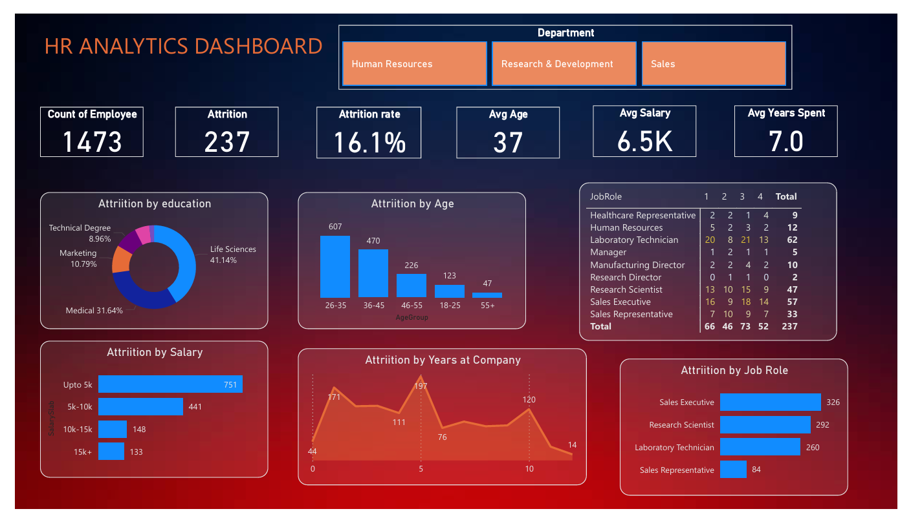

# HR Analytics Dashboard — Power BI

An interactive Power BI dashboard analyzing employee attrition patterns across a workforce of **1,473 employees**, designed to help HR and business teams identify retention risks and take data-driven action.

---

## Dashboard Preview

---

## Objective

To analyze key HR metrics and identify the primary drivers of employee attrition — helping organizations reduce turnover, improve workforce planning, and target retention efforts effectively.

---

## Dataset

- **File:** `HR_Analytics.csv`
- **Records:** 1,473 employees
- **Key columns:** Age, Department, Education, Job Role, Salary Slab, Years at Company, Attrition

---

## Key Metrics

| Metric | Value |
|---|---|
| Total Employees | 1,473 |
| Total Attrition | 237 |
| Attrition Rate | 16.1% |
| Average Age | 37 |
| Average Salary | ₹6.5K |
| Average Tenure | 7.0 years |

---

## Dashboard Features

**Attrition by Education**
- Life Sciences leads at 41.14%, followed by Medical (31.64%), Marketing (10.79%), and Technical Degree (8.96%)

**Attrition by Age Group**
- Highest attrition in the 26–35 age group (607 employees), declining sharply after 45

**Attrition by Salary Slab**
- 751 employees earning up to ₹5K show the highest attrition — a clear signal for compensation review

**Attrition by Job Role**
- Sales Executives (326) and Research Scientists (292) are the most at-risk roles

**Attrition by Years at Company**
- Peak attrition at Year 1 (197) and Year 5 (120), suggesting critical retention windows

**Job Satisfaction Matrix**
- Cross-tab of satisfaction rating (1–4) by job role showing 237 total attrition cases with per-role breakdown

**Department Filter**
- Interactive slicer for Human Resources, Research & Development, and Sales

---

## Technical Implementation

- **Tool:** Microsoft Power BI Desktop
- **DAX Measures:** Attrition Rate, Average Salary, Average Tenure, conditional KPI formatting
- **Visualizations:** Donut chart, bar charts, line chart, matrix table, KPI cards
- **Interactivity:** Department slicer filters all visuals dynamically

---

## Key Insights

1. **Salary is the strongest attrition driver** — employees earning under ₹5K account for the majority of exits
2. **Early tenure is critical** — attrition peaks at Year 1, suggesting onboarding and early engagement gaps
3. **Sales and R&D roles need targeted retention** — these two departments drive the most absolute attrition
4. **26–35 age group is highest risk** — likely due to career growth expectations not being met

---

## Files in This Repo

| File | Description |
|---|---|
| `HR_Analytics.csv` | Raw dataset used for the dashboard |
| `project1.pbix` | Power BI Desktop file (open with Power BI Desktop) |
| `project1 (1).pdf` | Static PDF export of the dashboard |

---

## How to Run

1. Download and install [Power BI Desktop](https://powerbi.microsoft.com/desktop/) (free)
2. Clone this repository
3. Open `project1.pbix` in Power BI Desktop
4. The dashboard will load with all visuals and interactivity intact

---

## Tools Used

- Microsoft Power BI Desktop
- DAX (Data Analysis Expressions)
- Microsoft Excel / CSV for data source
